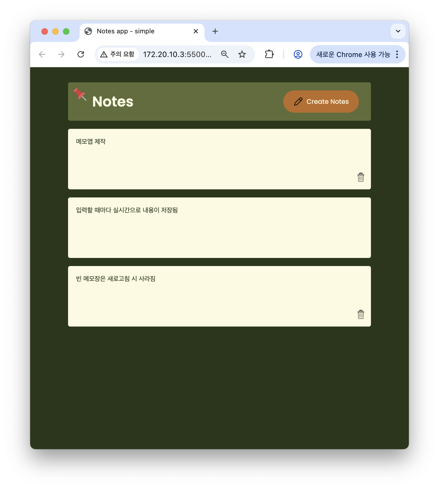
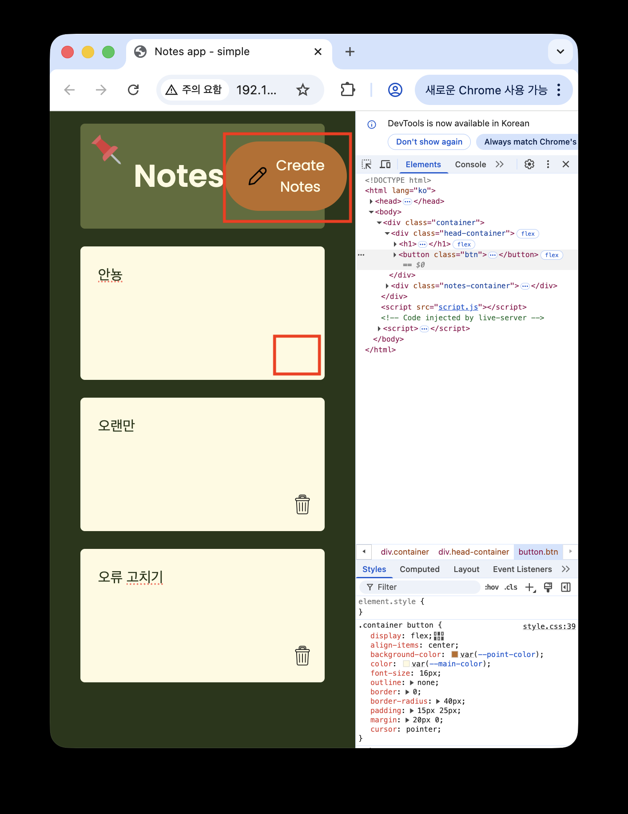

# No2. Notes app - Simple ver.

## Notes app 구현

**2025.09.14**

---

## 🛠️ 업데이트 내역 - 2025.11.01

### 기능 개선

**휴지통 아이콘 클릭 시 note 전체 삭제되도록 수정**

- 기존에는 `
` 요소만 삭제되어 아이콘만 사라지는 문제가 있었음
- 구조를 `
`로 감싸 note 단위로 삭제되도록 개선
- 커밋 메시지: `fix: 휴지통 아이콘 클릭 시 note 전체가 삭제되도록 수정`

### UI 개선

**Create 버튼 반응형 수정**

- 화면 크기에 따라 버튼 레이아웃이 깨지던 문제 해결
- 미디어 쿼리 이용과 min-width 조정으로 반응형 레이아웃 개선
- 커밋 메시지: `style: 버튼 반응형 스타일 및 container min-width 추가`

### 사용자 경험 개선

**새로 생성된 메모에 자동 포커스 기능 추가**

- 새로 생성된 메모에 바로 커서가 이동되도록 `inputBox.focus()` 적용
- 커밋 메시지: `feat: 새 메모 생성 시 자동 포커스 기능`

---

## 개념공부 (새로 알게된 것 & 복습)

### `contenteditable` 속성;

- 요소의 콘텐츠를 편집할 수 있는지 여부
- 속성값을 `true`로 설정하면 요소의 콘텐츠 편집 가능

### img.setAttribute("src", "주소") 대신 img.src="주소" 를 쓴 이유

(cf. `inputBox.setAttribute("contenteditable", "true");`)

- img도 setAttribute로 src 주소 등록할 수 있으나, DOM 프로퍼티가 직접 지원되므로 짧고 직관적이게 img.src = ... 로 작성함
- src 이외, id, className, href 속성도 동일

### onkeyup 이벤트를 사용한 이유?

- 보통 메모앱에서는 입력될 때마다 스토리지에 저장되도록 함
- 메모앱이나 에디터처럼 실시간 저장이 필요한 것은 input or keyup
- 간단한 입력폼(이름, 주소 입력 후 제출)은 blur or 최종 submit 시점에만 저장

### `querySelector()` VS `querySelectorAll()`

- querySelector() 는 첫번째로 일치하는 요소 하나를 반환
- querySelectorAll() 은 일치하는 모든 요소를 `NodeList`라는 배열 형태로 반환

### 메모 삭제 시, 이벤트리스너를 img(휴지통 아이콘)가 아닌 notesContainer 에 적용한 이유 - 이벤트 위임

- img.addEventListener로만 처리한다면, 새로 추가되는 Img마다 이벤트를 일일이 붙여야 함
- 요소가 많아질수록 각 img마다 리스너를 붙이면 메모리 및 성능 낭비
- 부모 한 군데에만 리스너를 걸고 e.target으로 분기하면 효율적임

## 인사이트

### CSS 색상 팔레트

- CSS 변수 설정하여 색상 팔레트로 요소 색상 적용
- 여기서 var()는 CSS 전용 함수 _(자바스크립트의 var, let, const와는 완전히 별개)_

### 커스텀 포커스 스타일

- outline의 기본 디자인을 none으로 없애기만 하면 접근성 문제가 있음
- outline: none; 와 함께 커스텀 포커스 스타일 적용하여 문제 해결

---

레퍼런스
https://www.youtube.com/watch?v=n3U4jFbp05M&list=PLjwm_8O3suyOgDS_Z8AWbbq3zpCmR-WE9&index=6
