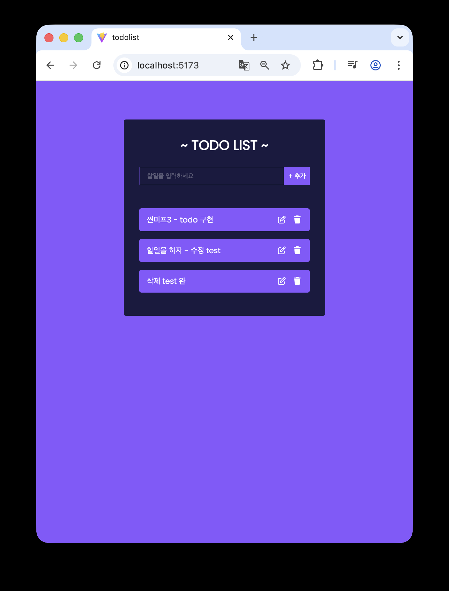

# No3. Todo List - react

## React로 TodoList 구현

**2025.09.21**

---

## 🛠️ 업데이트 내역 - 2025.11.09

### 🪄 코드 품질 개선

**key 값으로 index 대신 고유 id 사용**

- 리스트 렌더링 시 `key`를 index로 지정하면 삭제 시 데이터 꼬임 발생
- `uuidv4()`로 고유 id 생성해 안정적 렌더링 구현
- 커밋 메시지: `fix: Todo key값 index에서 id로 변경`

**매직 스트링(Magic String) 제거**

- 하드코딩된 문자열을 상수/변수로 대체하여 유지보수성 향상
- 커밋 메시지: `refactor: localStorage key를 STORAGE_KEY 상수로 분리`

### ⚙️ 기능 개선

**LocalStorage 에러 핸들링 추가**

- `try-catch` 문으로 `localStorage` 접근 시 발생 가능한 예외 처리
- 브라우저 저장소 권한 문제 등 예외 상황 대응 가능
- 커밋 메시지: `feat: localStorage 에러 핸들링 추가`

**커스텀 훅(`useTodos`)으로 로직 분리**

- todos 상태 관리 및 CRUD 로직을 `useTodos.js`로 분리
- 컴포넌트 간 관심사 분리 및 코드 재사용성 향상
- 커밋 메시지: `feat: useTodos 커스텀 Hook 생성`, `refactor: TodoWrapper에서 useTodos Hook 사용`

### 💡 구조 및 UI 개선

**Props 네이밍 컨벤션 정리**

- 이벤트 핸들러 props를 `on` prefix로 변경 (`onAdd`, `onEdit`, `onToggle`, `onDelete`)
- React 컨벤션 준수 및 가독성 향상
- 커밋 메시지: `refactor: Todo 컴포넌트 props 구조 개선`

**클릭 포인터 비활성화 버그 수정**

- todo 항목 클릭 시 포인터 미작동 문제 원인 → `incompleted` 클래스 미적용 확인
- CSS 클래스 활성화로 정상 작동되도록 개선
- 커밋 메시지: `fix: incompleted 클래스 활성화 및 아이콘 className 추가`

### ⚡ 성능 개선

**불필요한 리렌더링 최소화**

- 함수 및 상태 변경 시 의존성 배열 관리로 리렌더링 횟수 감소
- 성능 최적화 패턴 학습 및 적용
- 커밋 메시지: `perf: useTodos 함수들을 useCallback으로 최적화`, `perf: Todo 컴포넌트를 React.memo로 최적화`

---

## 인사이트

### Edit Form 관련

<레퍼런스 - TodoForm의 내용을 모두 복사해 EditTodoForm에서 사용>

- 불필요한 중복 코드가 발생할 수 있을 것이라 판단함
- 이외 문제: 컴포넌트 확장성 떨어짐

- 개선: 하나의 재사용 가능한 Form으로 통합(prop으로 동작을 바꾸는 방식)

## 개념공부 (새로 알게된 것 & 복습)

### FontAwesome 설치 및 사용

### rafc 스니펫

- 확장 프로그램 설치

### uuid 라이브러리

- 리액트 라이브러리
- 고유한 id값을 자동으로 추가해줌

### form 의 기본 동작과 `e.preventDefault()`

- form 의 기본 동작: 엔터를 누르거나 submit 버튼을 누르면 페이지가 새로고침되며 서버로 데이터를 보내려 함
- input에 글을 작성하고 button을 눌러 submit할 때,  
  **e.preventDefault(); 가 없으면?** - form의 submit 이벤트가 발생하여 새로고침 됨 -> input 값 초기화  
  **e.preventDefault(); 가 있으면?** - 새로고침을 막아 리액트 state로 글 처리 가능

---

레퍼런스
https://www.youtube.com/watch?v=LoYbN6qoQHA
