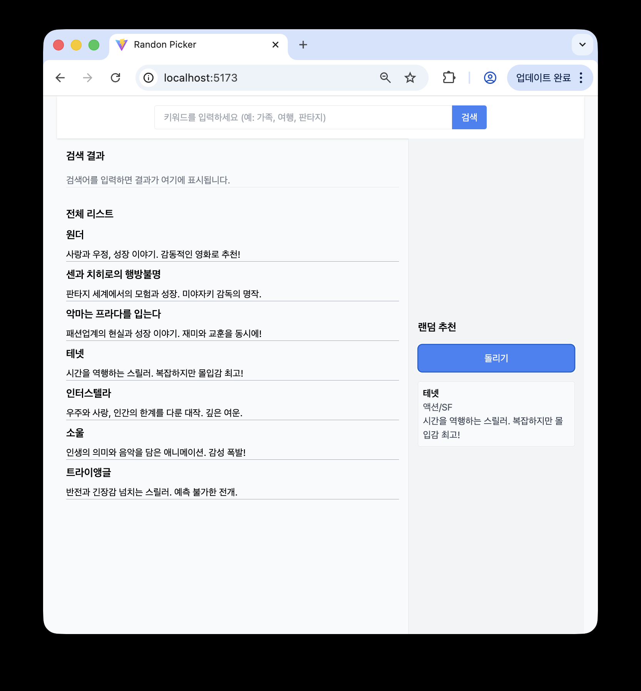

# No4. Random Picker App

## React로 랜덤 영화 추천 페이지 구현

### 2025.09.28

---

## 🛠️ 업데이트 내역 - 2025.11.16

### 🎨 UI 개선

**RandomPicker 결과 영역 높이 고정**

- 랜덤 추천 정보가 렌더링될 때 상단 타이틀/버튼이 밀리는 문제 해결
- 추천 결과 영역을 min-height로 고정하여 레이아웃 안정성 확보
- 커밋 메시지: style: RandomPicker 결과 영역 고정 높이로 UI 흔들림 개선

### 🚀 향후 업데이트 예정 기능

#### 🔗 TMDB Open API 연동

- 영화 포스터 이미지 표시
- 더 많은 영화 리스트 요청 (장르별, 인기순, 최신순 API 연결)
- 클릭 시 상세 정보 카드 표시 기능 확장
- 안전한 API Key(token) 입력 방법 구현

#### ⚡ 성능 개선 예정

**Debounce 적용 (검색 최적화)**

- 검색 input 입력마다 API 과다 호출 방지
- 입력이 멈춘 후 일정 시간 뒤 1번만 호출되도록 구현

**Throttle 적용 (무한 스크롤 대비)**

- 스크롤 이벤트 연속 발생 시 성능 저하 방지
- 일정 주기마다 API 호출하도록 제한하여 안정적 로딩 구현

---

## 인사이트

### 검색 filter

- 제목만 검색 필터되던 조건을 모든 내용 필터되도록 변경

### UI 변경

- 검색 결과 표시 부분, 랜덤 추천 부분 UI 변경

### Tailwind CSS 사용

## 개념공부 (새로 알게된 것 & 복습)

### Tailwind CSS

- Tailwind는 기본 HTML 요소 크기를 무시하고 className 기준으로 스타일링 함
- 그럼에도 <h3> <h2> 등 HTML 태그 사용 이유는 시맨틱(접근성) 때문
