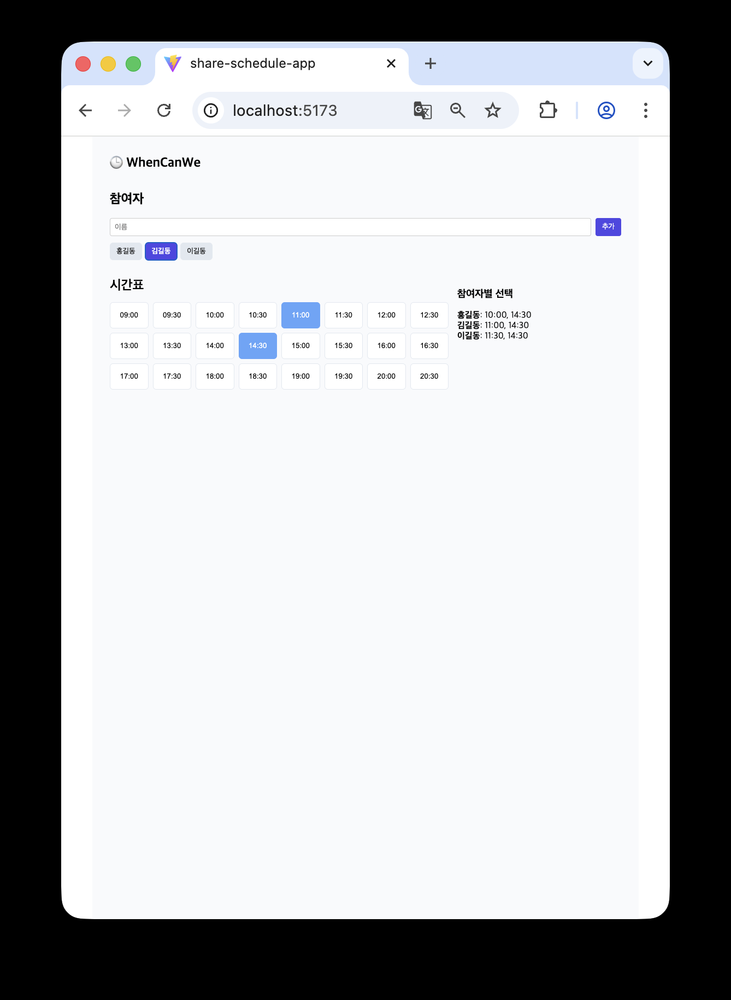

# No5. Share Schedule App

## 약속 시간 정하기 툴

### 2025.10.12

## 인사이트

### clsx 라이브러리 사용

## 개념공부

### new Set()

- Set은 중복을 허용하지 않는 배열 같은 자료구조
- 특징
  1. push() 대신 add()
  2. includes() 대신 has()
  3. 중복 제거에 강력

### .has() 프로퍼티

- Set이나 Map 객체 안에 특정 값이 있는지 확인할 때 사용하는 내장 메서드

`// 예시
const selcetedSlots = new Set(["10:00", "11:00"]);

console.log(selectedSlots.has("10:00")) // true
console.log(selectedSlots.has("12:00")) // false`

- 사용자가 클릭한 시간 슬롯을 Set에 저장하고 그 슬롯이 선택된 상태인지(has()) 확인해 CSS클래스를 다르게 주기 위해 사용

### padStart() 메서드

- String 객체 메서드
- 문자열의 시작부분에 지정된 길이만큼 다른 문자열을 추가해 새로운 문자열 반환
- `string.padStart(targetLength, padString)`

### rem 단위를 많이 쓰는 이유

- rem = HTML 루트 글꼴 크기 기준
- 사용자 디바이스 설정에 따라 자동 비율 조정이 가능하며, 픽셀(px) 보다 유연하고 유지보수에 강한 단위이기 때문

## 레퍼런스

when2meet https://www.when2meet.com/
