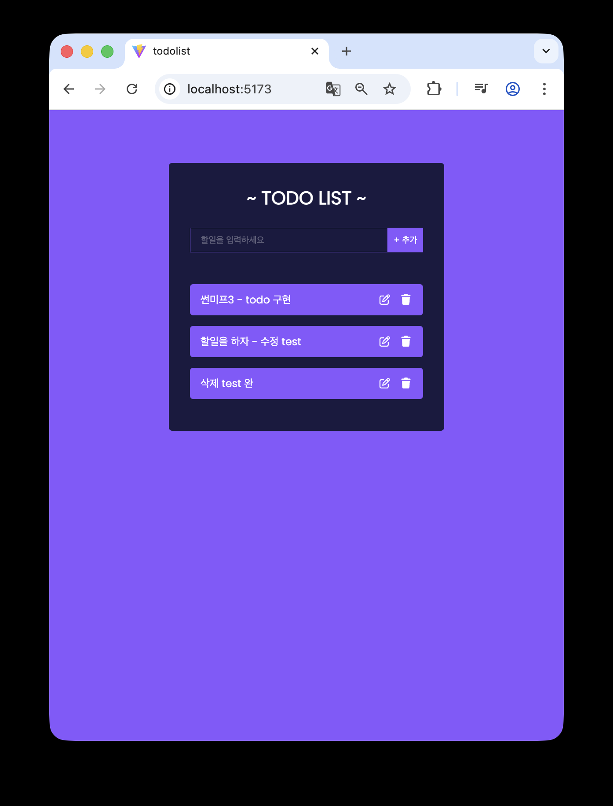

# No3. Todo List - react

## React로 TodoList 구현

**2025.09.21**

## 인사이트

### Edit Form 관련

<레퍼런스 - TodoForm의 내용을 모두 복사해 EditTodoForm에서 사용>

- 불필요한 중복 코드가 발생할 수 있을 것이라 판단함
- 이외 문제: 컴포넌트 확장성 떨어짐

- 개선: 하나의 재사용 가능한 Form으로 통합(prop으로 동작을 바꾸는 방식)

## 개념공부 (새로 알게된 것 & 복습)

### FontAwesome 설치 및 사용

### rafc 스니펫

- 확장 프로그램 설치

### uuid 라이브러리

- 리액트 라이브러리
- 고유한 id값을 자동으로 추가해줌

### <form> 의 기본 동작과 `e.preventDefault()`

- <form>의 기본 동작: 엔터를 누르거나 submit 버튼을 누르면 페이지가 새로고침되며 서버로 데이터를 보내려 함
- input에 글을 작성하고 button을 눌러 submit할 때,
  **e.preventDefault(); 가 없으면?** - form의 submit 이벤트가 발생하여 새로고침 됨 -> input 값 초기화
  **e.preventDefault(); 가 있으면?** - 새로고침을 막아 리액트 state로 글 처리 가능

---

레퍼런스
https://www.youtube.com/watch?v=LoYbN6qoQHA
